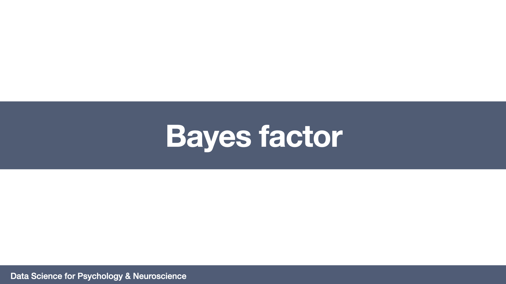

# Bayes factor
=======================

## Required readings
-Wagenmakers, E. J. (2007). A practical solution to the pervasive problems of p values. Psychonomic bulletin & review, 14(5), 779-804.

## Lecture

