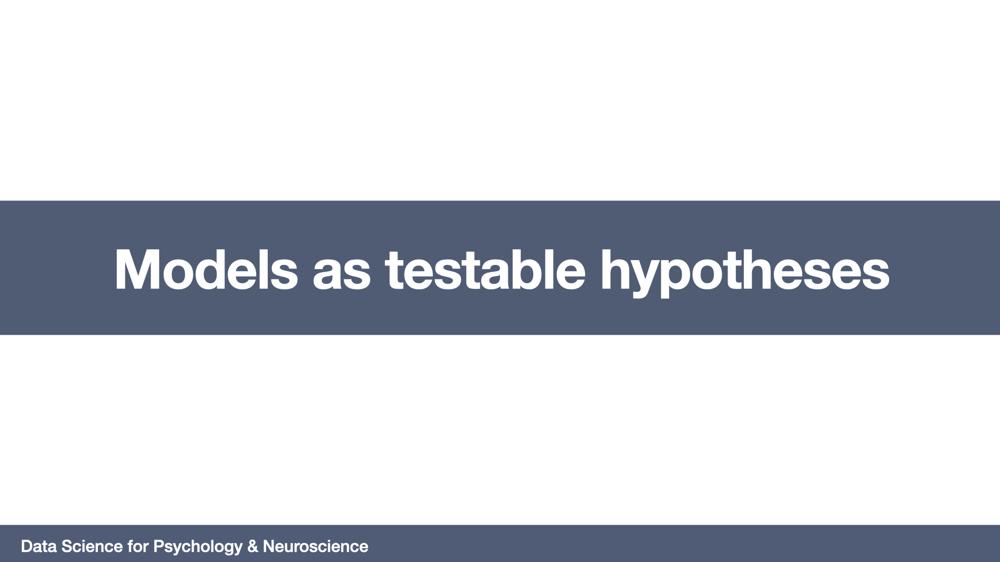

# Models as testable hypotheses
=======================

## Required readings

- A Survey of Some Fundamental Problems. In Popper, K. (1959). The logic of scientific discovery. Routledge.

- Guest, O., & Martin, A. E. (2021). On logical inference over brains, behaviour, and artificial neural networks. Psyarxiv

## Lecture

## Slides

