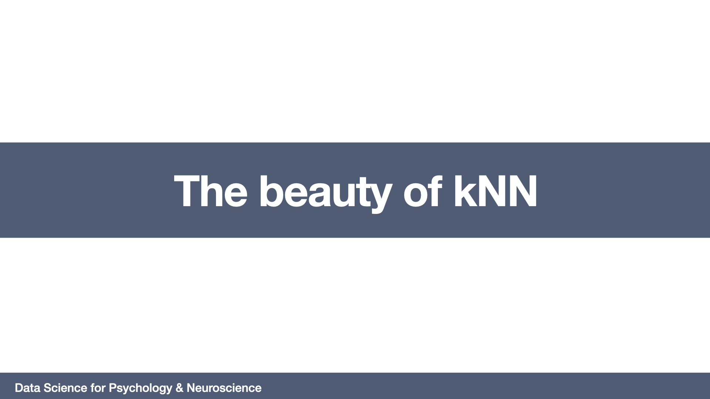

# The beauty of kNN
=======================

## Required readings

- Chapter 2: Statistical learning. James, G., Witten, D., Hastie, T., & Tibshirani, R. (2013). An introduction to statistical learning: with applications in R (Vol. 6). New York: Springer.

- Chapter 4: Classification. James, G., Witten, D., Hastie, T., & Tibshirani, R. (2013). An introduction to statistical learning: with applications in R (Vol. 6). New York: Springer.

## Lecture

