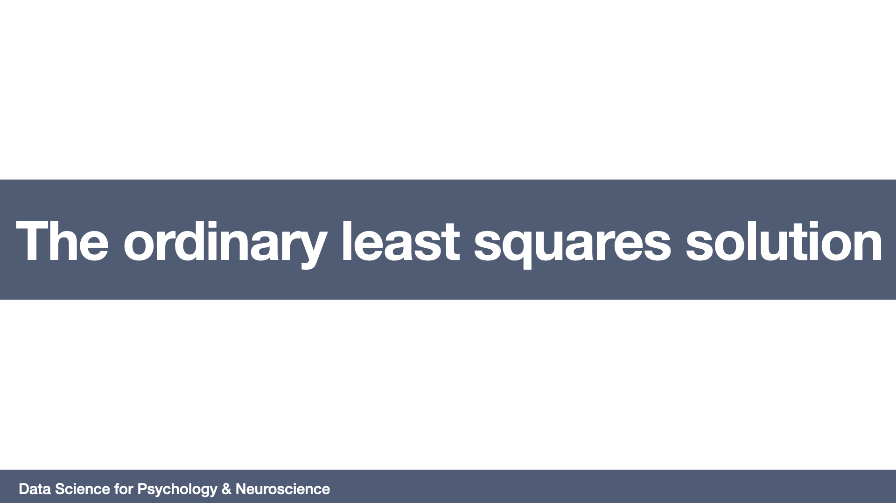

# The ordinary least squares solution
=======================

## Required readings

- Chapter 3: Linear regression. James, G., Witten, D., Hastie, T., & Tibshirani, R. (2013). An introduction to statistical learning: with applications in R (Vol. 6). New York: Springer

## Lecture

