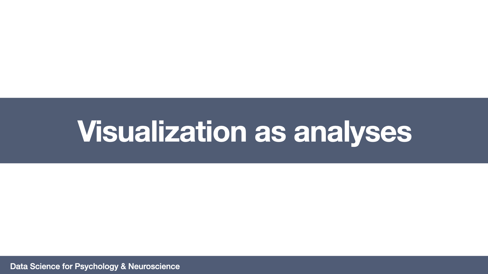

# Visualization as analysis
=======================

## Required readings

- Cairo, A. (2012). The Functional Art: An introduction to information graphics and visualization. New Riders. Chapters 1 & 3.

- Yanai, I., & Lercher, M. (2020). A hypothesis is a liability. Genome Biology, 21, 1

## Lecture (Video)

## Slides (PDF)

